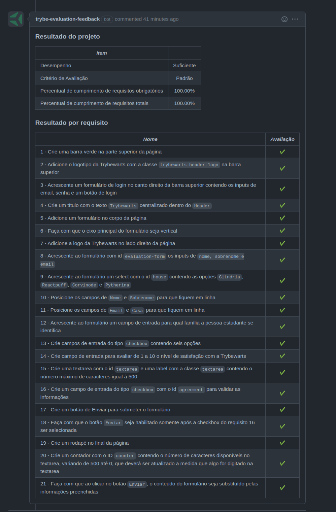

# Projeto TrybeWarts

Esse projeto foi desenvolvido em grupo utilizando HTML, CSS e JavaScript. Todos os 21 requisitos totais foram concluídos.

Foi desenvolvida uma página de formulário da Escola de Magia de Trybewarts, em que as pessoas estudantes poderão enviar seus feedbacks sobre ela. O tema desse projeto é baseado na obra 'Harry Potter', de J. K. Rowling, já que programar é o mais próximo que podemos chegar de algo **verdadeiramente mágico**!

Neste projeto, as habilidades avaliadas foram:

* Criar formulários em HTML;
* Utilizar CSS Flexbox para criar layouts flexíveis;
* Criar regras CSS específicas para serem aplicadas a dispositivos móveis;
* Construir páginas que alteram o seu layout de acordo com a orientação da tela;

O projeto foi iniciado ao final do Bloco 06 do Módulo de Fundamentos do Desenvolvimento Web da [Trybe](https://www.betrybe.com/).

---

## Imagem com o resultado final

---

## Imagem com o desempenho e nota obtidos

